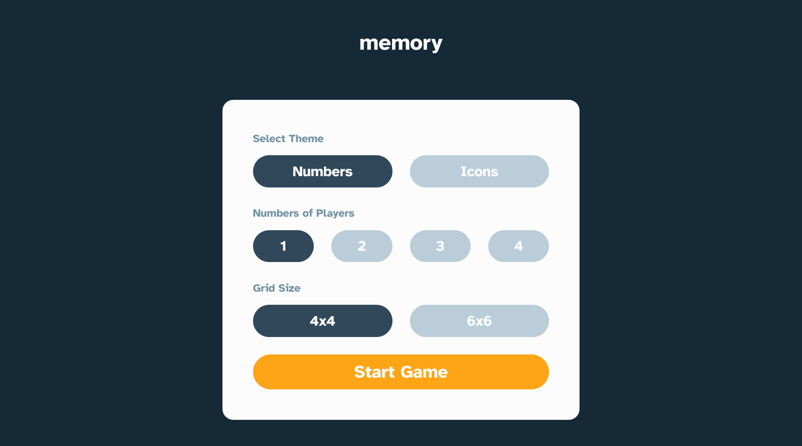

# Frontend Mentor - Memory game solution

This is a solution to the [Memory game challenge on Frontend Mentor](https://www.frontendmentor.io/challenges/memory-game-vse4WFPvM).

## Table of contents

- [Overview](#overview)
  - [The challenge](#the-challenge)
  - [Screenshot](#screenshot)
  - [Links](#links)
- [My process](#my-process)
  - [Built with](#built-with)
  - [What I learned](#what-i-learned)
- [Author](#author)

## Overview

### The challenge

Users should be able to:

- View the optimal layout for the game depending on their device's screen size
- See hover states for all interactive elements on the page
- Play the Memory game either solo or multiplayer (up to 4 players)
- Set the theme to use numbers or icons within the tiles
- Choose to play on either a 6x6 or 4x4 grid

### Screenshot

### Links

- Solution URL: [Add solution URL here](https://github.com/kaamiik/fm-memory-game-using-next-ts-tailwind)
- Live Site URL: [Vercel](https://memory-game-kiaaka.vercel.app/)

## My process

### Built with

- Semantic HTML5 markup
- CSS
- Mobile-first workflow
- [React](https://reactjs.org/) - JS library
- [Next.js](https://nextjs.org/) - React framework
- [TailwindCSS](https://tailwindcss.com/) - For styles
- [TypeScript](https://www.typescriptlang.org/docs/)

### What I learned

This project was an excellent opportunity to practice complex state management and game logic implementation. Here are the key learnings:

**Next.js App Router & Search Params**: I learned to effectively use Next.js 14's App Router with async server components and search parameters for game configuration. The `searchParams` prop allowed me to create a clean URL-based state management system where game settings (theme, players, grid size) are reflected in the URL, making the game shareable and bookmarkable.

**Complex State Management**: Managing the game state was challenging but rewarding. I implemented a comprehensive state system handling cards, player turns, scores, moves, and game processing states. The `useCallback` hooks were crucial for preventing unnecessary re-renders and maintaining performance during rapid card interactions.

**Custom Hooks & Reusable Components**: Created a custom `useTimer` hook for tracking game time and built modular components like `CardButton`, `CardGrid`, and `GameDialog` that can be easily reused and tested. The component architecture follows the single responsibility principle, making the codebase maintainable.

**CSS Animations & 3D Transforms**: Implemented smooth card flip animations using CSS 3D transforms (`rotate-y-180`) and transitions. The cards have a realistic flip effect with proper backface visibility handling, creating an engaging user experience.

**Game Logic Implementation**: Built robust game logic including card matching, turn management for multiplayer (up to 4 players), score tracking, and win condition detection. The logic handles edge cases like preventing clicks during processing states and managing player transitions.

**TypeScript & Type Safety**: Leveraged TypeScript throughout the project for better development experience and runtime safety. Created proper type definitions for game state, card objects, and component props, which helped catch errors early and improved code documentation.

**Responsive Design with Tailwind**: Used Tailwind CSS with custom CSS variables for consistent theming and responsive design. The game adapts seamlessly from mobile to desktop with appropriate grid layouts and spacing.

**Context API for Global State**: Implemented React Context for sharing game actions (like restart functionality) across components without prop drilling, demonstrating clean state management patterns.

## Author

- Frontend Mentor - [@kaamiik](https://www.frontendmentor.io/profile/kaamiik)
- Twitter - [@kiaakamran](https://www.twitter.com/kiaakamran)
